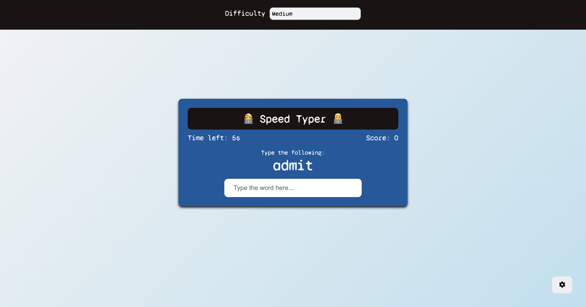

# Speed Typer

Speed Typer is a fun and interactive typing game where you test your typing speed and accuracy by typing random words within a limited time. The game includes difficulty levels to challenge players of all skill levels.

## Live Preview

You can try the game live [here](#).

## Screenshots

### Game Interface

## Features

- Randomly generates words for typing.
- Tracks your score based on the number of correctly typed words.
- Countdown timer to add urgency to the game.
- Difficulty levels:
  - **Easy**: Adds 5 seconds for each correct word.
  - **Medium**: Adds 3 seconds for each correct word.
  - **Hard**: Adds 2 seconds for each correct word.
- Responsive design for desktop and mobile devices.
- Option to restart the game after the timer runs out.
- Saves the selected difficulty level in local storage.

## Technologies Used

- **HTML**: For structuring the game interface.
- **CSS**: For styling the game and making it visually appealing.
- **JavaScript**: For game logic and interactivity.

## How to Play

1. Open the game in your browser.
2. Select a difficulty level from the settings panel.
3. Type the word displayed on the screen in the input box.
4. Each correct word increases your score and adds time based on the selected difficulty.
5. The game ends when the timer runs out.
6. Restart the game by clicking the "Play Again" button.

## Project Structure
GitHub Copilot
Speed Typer/ ├── index.html # Main HTML file ├── style.css # Stylesheet for the game ├── script.js # JavaScript file for game logic ├── assets/ # Folder containing screenshots and other assets └── readme.md # Project documentation

## How to Run the Project

1. Clone the repository or download the project files.
2. Open the `index.html` file in your browser.
3. Start playing the game!

## Future Improvements

- Add a leaderboard to track high scores.
- Include more words to increase variety.
- Add sound effects for correct and incorrect inputs.
- Implement a multiplayer mode for competitive typing.

## License

This project is open-source and available under the [MIT License](https://opensource.org/licenses/MIT).

---
Enjoy the game and improve your typing speed!